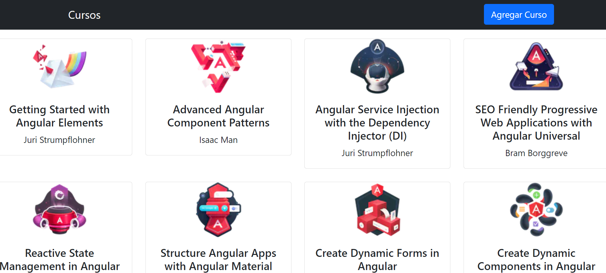

# Courses app when learning reactive forms



---

### Description
A very simple TODO kind with small reactive form with some validations. Done when learning angular forms.


---

## Use

First to run the json data as a server need to have install the package json-server.
[NPM - Json-server](https://www.npmjs.com/package/json-server). Run the json with the command ```json-server --watch courses.data.json```
To run the angular application run npm install to get the needed packages and ng serve -o to run it in a local server.

---

## Technologies

- Angular
- Type Script
- Bootstrap

---
## Author Info

- Linkedin - [Federico Andrés Jácome Castañeda](https://www.linkedin.com/in/federicojacome/)
- Website - [Portfolio](https://federocky.github.io/PersonalWeb/)

[Back To The Top](#read-me-template)
